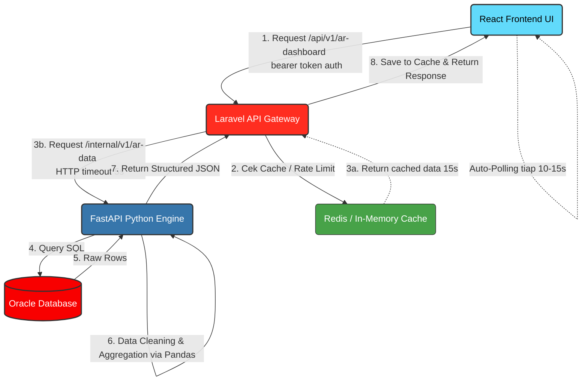

# 📑 PENJELASAN PROYEK: REAL-TIME AR DASHBOARD SEGMEN ERS

Dokumen ini menjelaskan secara menyeluruh arsitektur, cara kerja sistem, struktur database, endpoints, data yang ditarik, dan tiga framework utama yang digunakan dalam proyek **Dashboard AR (Account Receivable) Segmen ERS**. Dokumen ini juga menjelaskan konsep implementasi pipeline data dari **Excel $\rightarrow$ Database $\rightarrow$ Dashboard**.

---

## 1. ⚙️ CARA KERJA SISTEM SECARA MENYELURUH

Sistem ini dirancang menggunakan pola arsitektur **Microservices & API Gateway** yang memisahkan tanggung jawab antara antarmuka pengguna, gerbang keamanan/caching, dan mesin pengolahan data.

### Diagram Arsitektur Data Flow


### Langkah Kerja Alur Data (End-to-End):
1. **Request dari Frontend (React)**: Browser pengguna memuat halaman dashboard React. Komponen dashboard mengirimkan request HTTP GET ke Laravel API Gateway (`/api/v1/ar-dashboard`) dengan menyertakan *Bearer Token* di dalam header request sebagai autentikasi.
2. **Autentikasi & Caching di Gateway (Laravel)**:
   - Laravel memvalidasi token menggunakan **Laravel Sanctum**. Jika tidak valid atau request melebihi rate-limiting (30 request/menit), request ditolak.
   - Jika valid, Laravel memeriksa apakah data agregasi dashboard sudah tersimpan di **In-Memory Cache (Redis/File)**.
   - **Cache HIT (Tersedia)**: Laravel langsung mengembalikan data dari cache ke Frontend (kurang dari 15 detik sejak fetch terakhir) tanpa menyentuh Python/Oracle. Ini melindungi database dari beban berlebih.
   - **Cache MISS (Tidak Tersedia/Expired)**: Laravel meneruskan request ke Python Engine melalui jaringan internal (`http://127.0.0.1:8000/internal/v1/ar-data`).
3. **Pemrosesan Data di Engine (Python FastAPI)**:
   - Python Engine menerima request dari Laravel.
   - Menggunakan **SQLAlchemy** atau library driver **`oracledb`**, Python membuat koneksi ke Oracle Database dan melakukan query untuk menarik data mentah dari 5 tabel utama.
   - Data mentah tersebut dimasukkan ke dalam **Pandas DataFrame**.
   - Pandas melakukan *data cleaning* (mengisi nilai `NULL` pada angka dengan `0.0`, membersihkan string kosong, menyamakan format casing kolom) dan melakukan agregasi kalkulasi finansial (seperti total AR, rasio kelayakan tagih, overdue per wilayah, dsb.).
   - Data dikonversi menjadi format JSON standar dan dikembalikan ke Laravel Gateway.
4. **Respon Akhir**: Laravel menyimpan respon JSON tersebut ke dalam cache (berdurasi 15 detik), lalu mengirimkannya kembali ke React Frontend dengan header HTTP tambahan (`X-AR-Cache` dan `X-AR-Source`) untuk keperluan monitoring performa.
5. **Auto-Polling**: React Frontend menampilkan data ke layar dengan visualisasi grafik dan tabel, lalu secara otomatis memicu fungsi *auto-polling* (`setInterval`) setiap 15 detik untuk memastikan data di dashboard selalu diperbarui secara real-time.

---

## 2. 🗄️ STRUKTUR DATABASE (ORACLE ENTERPRISE DB)

Sistem menggunakan database Oracle dengan 5 tabel utama yang menyimpan data piutang, tren historis, ramalan arus kas, dan segmentasi pelanggan.

### A. Tabel Utama & Kolom Masing-Masing:

#### 1. `AR_SEGMEN_ERS_TBL` (Tabel Transaksi/Invoice)
Menyimpan snapshot data invoice piutang (Account Receivable) yang aktif.
- `INVOICE_ID` (VARCHAR2(50) - **PRIMARY KEY**): Nomor unik invoice (contoh: `INV-2026-001`).
- `CUSTOMER_NAME` (VARCHAR2(100)): Nama pelanggan/debitur.
- `AGING_CATEGORY` (VARCHAR2(50)): Kategori umur piutang (`Within Due`, `0-30 Days`, `31-60 Days`, `61-90 Days`, `>90 Days`).
- `STATUS_TAGIH` (VARCHAR2(50)): Status penagihan (`AR LAYAK TAGIH`, `AR BERMASALAH`, `AR TIDAK LAYAK TAGIH`).
- `REGION` (VARCHAR2(50)): Wilayah transaksi (contoh: `North America`, `Europe`, `Jakarta`).
- `INVOICE_STATUS` (VARCHAR2(50)): Status penulisan tagihan (`SUDAH INVOICED`, `UNBILLED`).
- `NILAI_M` (NUMBER(18,2)): Nilai nominal piutang dalam Miliar Rupiah/USD (contoh: `68.95`).
- `UIC` (VARCHAR2(50)): Unit In Charge / Penanggung jawab (contoh: `CGA`, `SEGMEN`, `BILLING`).
- `DUE_DATE` (VARCHAR2(30)): Tanggal jatuh tempo invoice.
- `ACTION_PLAN` (VARCHAR2(200)): Rencana tindak lanjut penagihan (contoh: `Escalate for review`, `Monitoring bayar`).
- `ABOVE_CREDIT_LIMIT` (NUMBER(1)): Flag biner (`0` atau `1`) penanda jika piutang melewati batas kredit pelanggan.

#### 2. `AR_CASH_INFLOW_FORECAST_TBL` (Tabel Peramalan Kas Masuk)
Digunakan untuk grafik perbandingan penerimaan kas aktual, estimasi, dan peramalan (forecast).
- `MONTH_LABEL` (VARCHAR2(30) - **PRIMARY KEY**): Label bulan (contoh: `May 2020`).
- `SORT_ORDER` (NUMBER(3)): Urutan pengurutan data kronologis di chart.
- `ACTUAL_RECEIPTS` (NUMBER(18,2)): Penerimaan kas riil/aktual.
- `ESTIMATED_RECEIPTS` (NUMBER(18,2)): Estimasi awal kas masuk.
- `FORECASTED_RECEIPTS` (NUMBER(18,2)): Hasil proyeksi/ramalan kas masuk.

#### 3. `AR_TREND_T13M_TBL` (Tabel Tren 13 Bulan Terakhir)
Menyimpan tren saldo piutang bulanan untuk grafik garis/batang.
- `MONTH_LABEL` (VARCHAR2(30) - **PRIMARY KEY**): Label bulan tren.
- `SORT_ORDER` (NUMBER(3)): Urutan urut bulan.
- `WITHIN_DUE` (NUMBER(18,2)): Nominal piutang yang belum jatuh tempo.
- `OVER_DUE` (NUMBER(18,2)): Nominal piutang yang sudah jatuh tempo (overdue).
- `CREDIT_SALES` (NUMBER(18,2)): Nominal penjualan kredit pada bulan tersebut.

#### 4. `AR_METRICS_HISTORY_TBL` (Tabel Riwayat Metrik DSO & Overdue)
Menyimpan metrik performa bulanan untuk grafik mini (sparklines).
- `MONTH_LABEL` (VARCHAR2(30) - **PRIMARY KEY**): Bulan pencatatan metrik.
- `SORT_ORDER` (NUMBER(3)): Urutan bulan.
- `OVERDUE_PCT` (NUMBER(5,2)): Persentase piutang overdue dibanding total piutang.
- `DSO` (NUMBER(5)): Nilai *Days Sales Outstanding* (jumlah hari rata-rata penagihan piutang).

#### 5. `AR_TOP_CUSTOMERS_TBL` (Tabel Pelanggan Teratas)
Menyimpan data performa piutang per pelanggan/debitur utama.
- `CUSTOMER_NAME` (VARCHAR2(100) - **PRIMARY KEY**): Nama pelanggan.
- `BALANCE` (NUMBER(18,2)): Total saldo piutang pelanggan tersebut.
- `WITHIN_DUE` (NUMBER(18,2)): Saldo yang belum jatuh tempo.
- `OVER_DUE` (NUMBER(18,2)): Saldo overdue.
- `OVERDUE_PCT` (NUMBER(5,2)): Persentase saldo overdue milik pelanggan.
- `DUE_INVOICES` (NUMBER(5)): Jumlah lembar invoice yang overdue.
- `ABOVE_CREDIT_LIMIT` (NUMBER(1)): Penanda jika pelanggan melewati batas kredit.

---

## 3. 🔌 ENDPOINTS API

### A. Laravel API Gateway (Public REST API - Diakses oleh React Frontend)
Semua endpoint dilindungi oleh autentikasi token Sanctum kecuali pembuatan token pengembang.

| Method | Endpoint | Keterangan | Proteksi / Middleware |
| :--- | :--- | :--- | :--- |
| **POST** | `/api/v1/dev-token` | Membuat auth token developer secara cepat menggunakan email. | Public (Tanpa Auth) |
| **GET** | `/api/v1/ar-dashboard` | Mengambil seluruh data agregasi dashboard (KPI, Chart, Top Customers, List Invoice). | `auth:sanctum`, Cache 15s, Throttle (30 req/min) |
| **GET** | `/api/v1/tables/{table}` | Mengambil seluruh data baris mentah dari tabel tertentu di Oracle. | `auth:sanctum`, Throttle (30 req/min) |
| **POST** | `/api/v1/tables/{table}` | Menambahkan baris data baru ke tabel database. (*Auto-clear cache*). | `auth:sanctum`, Throttle (30 req/min) |
| **PUT** | `/api/v1/tables/{table}/{id}` | Mengubah isi data baris berdasarkan ID. (*Auto-clear cache*). | `auth:sanctum`, Throttle (30 req/min) |
| **DELETE**| `/api/v1/tables/{table}/{id}` | Menghapus baris data berdasarkan ID. (*Auto-clear cache*). | `auth:sanctum`, Throttle (30 req/min) |

---

### B. Python Data Engine (Internal REST API - Dipanggil oleh Laravel Gateway)
Berjalan secara lokal (internal port `8000`) dan tidak boleh dibuka ke publik demi keamanan database.

| Method | Endpoint | Keterangan |
| :--- | :--- | :--- |
| **GET** | `/` | Health check service status Python Engine. |
| **GET** | `/internal/v1/ar-data` | Menarik 5 tabel dari Oracle DB, melakukan data cleaning/handling `NULL`, menghitung agregasi finansial, dan mengembalikan response JSON terstruktur. |
| **GET** | `/internal/v1/tables/{table_name}`| Mengambil data mentah per tabel (via Pandas `to_dict`). |
| **POST** | `/internal/v1/tables/{table_name}`| Menjalankan SQL `INSERT` mentah ke database Oracle. |
| **PUT** | `/internal/v1/tables/{table_name}/{id_val}`| Menjalankan SQL `UPDATE` mentah ke database Oracle berdasarkan Primary Key. |
| **DELETE**| `/internal/v1/tables/{table_name}/{id_val}`| Menjalankan SQL `DELETE` mentah ke database Oracle berdasarkan Primary Key. |

---

## 4. 📊 DATA YANG DITARIK & DIAGREGASI

Python Engine mengolah data mentah dari Oracle menjadi payload terstruktur yang langsung siap pakai oleh UI Chart/Tabel di React:

1. **Summary / KPI Utama**:
   - `total_ar_m`: Total seluruh piutang yang beredar (Sum `nilai_m` di `AR_SEGMEN_ERS_TBL`).
   - `total_layak_tagih_m`: Total piutang lancar / belum jatuh tempo (Sum `nilai_m` dengan `aging_category == 'Within Due'`).
   - `total_tidak_layak_m`: Total piutang yang sudah lewat jatuh tempo (Sum `nilai_m` dengan `aging_category != 'Within Due'`).
   - `dso` & `overdue_pct`: Indikator performa efisiensi penagihan dan rasio keterlambatan pembayaran.
2. **Age Analysis**:
   - Pengelompokan nominal piutang berdasarkan kelompok umur: `Within Due`, `0-30 Days`, `31-60 Days`, `61-90 Days`, dan `>90 Days`.
3. **Region Breakup**:
   - Nominal overdue piutang dipecah per wilayah geografis (misal: *North America*, *Europe*, *Jakarta*) lengkap dengan persentase kontribusinya terhadap total overdue.
4. **Cash Inflow & Forecast**:
   - Rincian performa kas bulanan (kas masuk aktual vs estimasi vs perkiraan ke depan) untuk visualisasi peramalan finansial.
5. **T13M Trend & Sparkline**:
   - Array angka DSO bulanan dan persentase overdue bulanan untuk digambar sebagai grafik garis mini (sparklines).
6. **Top Customers**:
   - Daftar pelanggan teratas yang memiliki nominal overdue terbesar untuk mempermudah prioritas tim penagihan.

---

## 5. 🛠️ 3 FRAMEWORK YANG DIGUNAKAN & PERANNYA

Sistem ini memadukan 3 framework berbeda untuk memaksimalkan performa, keamanan, dan fleksibilitas pengembangan:

```
┌─────────────────────────────────┐
│     1. React (Frontend)         │ -> Mengurus State UI & Visualisasi Chart
└────────────────┬────────────────┘
                 │ (HTTP Request via Axios & Bearer Token)
┌────────────────▼────────────────┐
│     2. Laravel (Gateway)        │ -> Mengurus Autentikasi, Rate Limit, & Cache
└────────────────┬────────────────┘
                 │ (Internal HTTP Request)
┌────────────────▼────────────────┐
│     3. FastAPI (Python Engine)  │ -> Mengurus Koneksi Oracle & Analisis Pandas
└─────────────────────────────────┘
```

### A. FastAPI (Python) - *The Data Engine*
- **Mengapa digunakan?** Python adalah standar industri untuk analisis data (*Data Science*). FastAPI dipilih karena kinerjanya yang sangat cepat (asynchronous berbasis ASGI), kode yang ringkas, pengetikan statis menggunakan Pydantic, dan fitur dokumentasi interaktif otomatis (Swagger UI) yang langsung siap pakai.
- **Peran spesifik:** Menghubungkan langsung ke Oracle DB, membaca dataset secara instan ke dalam memori menggunakan **Pandas**, membersihkan data kotor/NULL, melakukan komputasi agregat statistik matematika yang kompleks dengan sangat cepat, lalu mengekspos hasilnya melalui REST API internal.

### B. Laravel (PHP) - *The API Gateway & Shield*
- **Mengapa digunakan?** Laravel sangat tangguh dalam urusan keamanan, penanganan otentikasi user, manajemen cache, dan pembuatan REST API terstandar. Sangat mudah dideploy di server enterprise dan memiliki ekosistem penunjang yang lengkap.
- **Peran spesifik:** Bertindak sebagai jembatan keamanan utama. Menangani login pengguna dan memproteksi rute API menggunakan **Laravel Sanctum**. Mengatur pembatasan request (*rate limiter*). Menyediakan lapisan **Caching (Redis/File)** berdurasi 15 detik untuk menghindari query berulang ke Oracle DB. Jika Python Engine mati, Laravel bertindak sebagai jaring pengaman dengan menyajikan data cache usang (*stale cache*) sehingga dashboard frontend tidak blank/error.

### C. React (JavaScript/TypeScript) - *The Dynamic UI*
- **Mengapa digunakan?** React menggunakan pendekatan berbasis komponen (*component-based*) dan Virtual DOM. Ini memungkinkan pembangunan antarmuka dashboard yang sangat responsif, interaktif, dan dinamis dengan performa render yang efisien.
- **Peran spesifik:** Meminta data dari Laravel secara berkala (polling), mengelola status/state lokal (seperti status loading, error, token autentikasi), me-render komponen KPI cards interaktif, tabel drill-down yang bisa diurutkan/difilter, diagram mind-map dari struktur AR, dan me-render grafik interaktif yang indah menggunakan library visualisasi (seperti **ECharts**).

---

## 6. 🔄 PIPELINE DATA: EXCEL $\rightarrow$ DATABASE $\rightarrow$ DASHBOARD

Jika perusahaan ingin memperluas sistem agar data piutang dapat ditarik dari file **Excel**, dimasukkan ke dalam **Oracle Database**, lalu ditampilkan di **Dashboard**, berikut adalah rancangan desain dan alur implementasi pipeline data tersebut:

### Diagram Alur Data Pipeline Excel
```
[ File Excel ]
      │ (Manual Upload via UI / Auto-scan SFTP)
      ▼
┌───────────────────────────────┐
│     Python Data Engine        │ 
│  - Pandas read_excel()        │ -> Ekstraksi, Validasi & Pembersihan Data
│  - Validasi Skema & Tipe Data │
└──────────────┬────────────────┘
               │ (SQLAlchemy Bulk Upsert)
               ▼
┌───────────────────────────────┐
│     Oracle Database           │ -> Data tersimpan rapi di AR_SEGMEN_ERS_TBL
└──────────────┬────────────────┘
               │ (FastAPI & Laravel Cache Flow)
               ▼
┌───────────────────────────────┐
│     Dashboard (React)         │ -> Angka & Grafik otomatis ter-update!
└───────────────────────────────┘
```

### Langkah Implementasi Pipeline:

#### Langkah 1: Pengiriman File Excel (Ingestion)
Ada dua metode yang bisa digunakan tergantung kebutuhan bisnis:
- **Metode A (Melalui User Interface - Ad-hoc)**:
  User meng-upload file Excel (`.xlsx` atau `.csv`) melalui menu khusus di React Frontend. File dikirim via API Multipart Form Data ke Laravel Gateway, lalu Laravel meneruskannya ke Python Engine.
- **Metode B (Otomatisasi Folder / SFTP - Scheduler)**:
  Sistem keuangan/ERP meletakkan file Excel laporan piutang di folder SFTP secara otomatis setiap hari pukul 24.00. Python Engine menjalankan *cron job* atau scheduler untuk memantau folder tersebut secara periodik dan langsung memproses file baru yang terdeteksi.

#### Langkah 2: Ekstraksi & Pembersihan Data (Python Pandas)
Di dalam Python Engine, file Excel tersebut dibaca menggunakan **Pandas**:
```python
import pandas as pd

# Membaca file excel
df_excel = pd.read_excel("path_to_excel.xlsx", sheet_name="Sheet1")

# Normalisasi nama kolom agar cocok dengan database Oracle
df_excel.columns = [c.strip().upper() for c in df_excel.columns]

# Data Cleaning (Wajib agar database tidak error)
df_excel['NILAI_M'] = pd.to_numeric(df_excel['NILAI_M'], errors='coerce').fillna(0.0)
df_excel['AGING_CATEGORY'] = df_excel['AGING_CATEGORY'].fillna('Within Due')
df_excel['STATUS_TAGIH'] = df_excel['STATUS_TAGIH'].fillna('AR LAYAK TAGIH')
df_excel['INVOICE_ID'] = df_excel['INVOICE_ID'].astype(str)
```

#### Langkah 3: Validasi Integritas Data
Sebelum dimasukkan ke database, data divalidasi:
- Memastikan kolom wajib seperti `INVOICE_ID` tidak kosong (`NULL`) dan tidak ada duplikat di dalam file Excel.
- Memastikan `STATUS_TAGIH` hanya berisi nilai yang diizinkan (misal: `AR LAYAK TAGIH`, `AR BERMASALAH`, atau `AR TIDAK LAYAK TAGIH`).

#### Langkah 4: Penyimpanan ke Database (Bulk Upsert / Merge)
Data yang sudah bersih dimasukkan ke dalam Oracle DB. Untuk menghindari eror duplikasi kunci utama (`Primary Key Violations`), kita menggunakan fungsi **`UPSERT`** (Update baris jika `INVOICE_ID` sudah ada di DB, Insert baris jika `INVOICE_ID` baru):
```python
from sqlalchemy import text

# Menggunakan koneksi SQLAlchemy untuk memproses merge data ke Oracle
def upsert_to_oracle(df, engine):
    with engine.begin() as connection:
        for _, row in df.iterrows():
            # SQL Merge Statement Oracle (UPSERT)
            merge_query = """
                MERGE INTO AR_SEGMEN_ERS_TBL target
                USING (SELECT :invoice_id AS invoice_id FROM dual) source
                ON (target.INVOICE_ID = source.invoice_id)
                WHEN MATCHED THEN
                    UPDATE SET 
                        CUSTOMER_NAME = :customer_name,
                        AGING_CATEGORY = :aging_category,
                        STATUS_TAGIH = :status_tagih,
                        REGION = :region,
                        INVOICE_STATUS = :invoice_status,
                        NILAI_M = :nilai_m,
                        UIC = :uic,
                        DUE_DATE = :due_date,
                        ACTION_PLAN = :action_plan,
                        ABOVE_CREDIT_LIMIT = :above_credit_limit
                WHEN NOT MATCHED THEN
                    INSERT (INVOICE_ID, CUSTOMER_NAME, AGING_CATEGORY, STATUS_TAGIH, REGION, INVOICE_STATUS, NILAI_M, UIC, DUE_DATE, ACTION_PLAN, ABOVE_CREDIT_LIMIT)
                    VALUES (:invoice_id, :customer_name, :aging_category, :status_tagih, :region, :invoice_status, :nilai_m, :uic, :due_date, :action_plan, :above_credit_limit)
            """
            connection.execute(text(merge_query), {
                "invoice_id": row["INVOICE_ID"],
                "customer_name": row.get("CUSTOMER_NAME", ""),
                "aging_category": row.get("AGING_CATEGORY", "Within Due"),
                "status_tagih": row.get("STATUS_TAGIH", "AR LAYAK TAGIH"),
                "region": row.get("REGION", ""),
                "invoice_status": row.get("INVOICE_STATUS", "SUDAH INVOICED"),
                "nilai_m": float(row.get("NILAI_M", 0.0)),
                "uic": row.get("UIC", ""),
                "due_date": str(row.get("DUE_DATE", "")),
                "action_plan": row.get("ACTION_PLAN", ""),
                "above_credit_limit": int(row.get("ABOVE_CREDIT_LIMIT", 0))
            })
```

#### Langkah 5: Pemicuan Refresh & Clear Cache (Laravel)
Setelah Python Engine sukses memproses Excel dan memperbarui Oracle DB:
1. Python mengirimkan sinyal ke Laravel Gateway, atau Laravel secara berkala membersihkan cache.
2. Di controller Laravel, cache langsung di-clear (`Cache::forget('oracle_ar_data_cache')`).
3. Pada siklus auto-polling berikutnya (maksimal 15 detik), React Frontend menarik data terbaru dari Laravel.
4. Dashboard otomatis diperbarui dengan data Excel yang baru dimasukkan secara instan dan tanpa harus melakukan reload browser manual.
